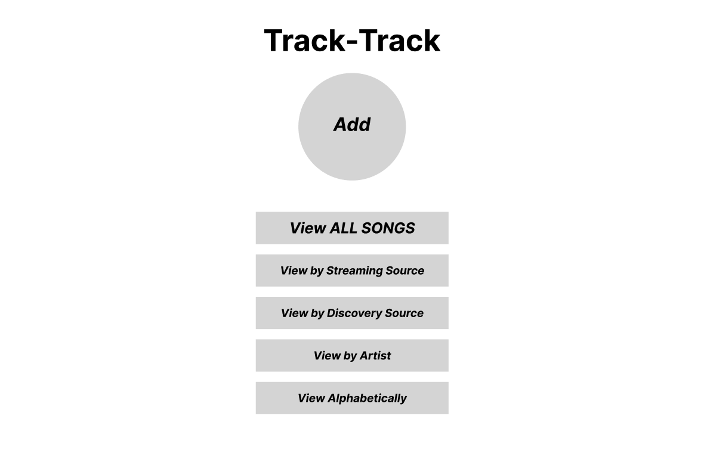
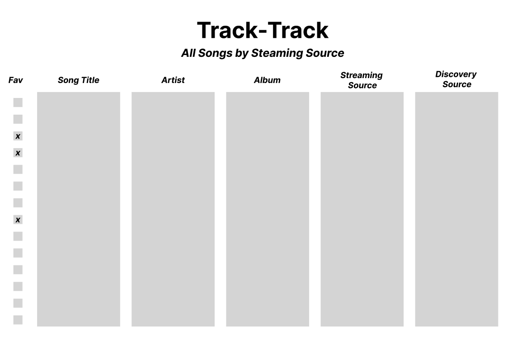
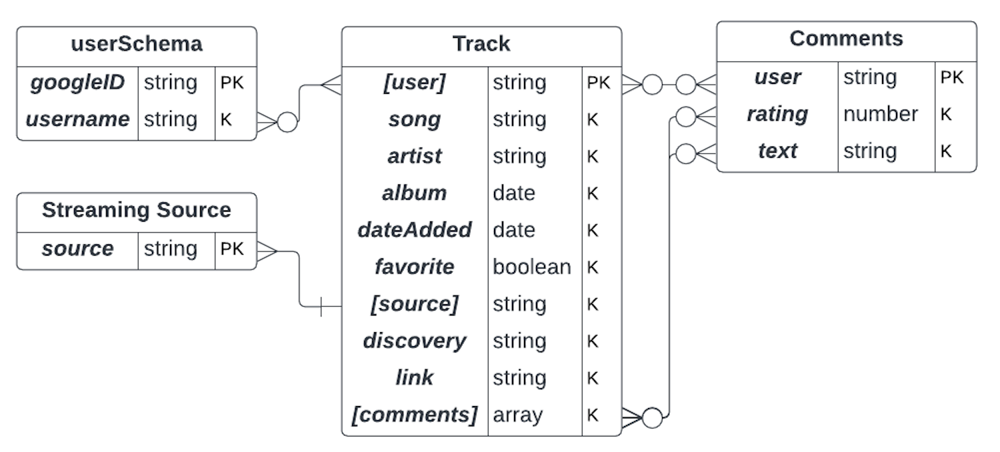

# Track-Track

## Overview

Track-Track is a solution to capture your entire music library in one place, regardless of the streaming source. The intention of Track-Track is not to play music, but rather to keep track of the music library of a user in an interactive database free of what music services they are currently subscribed to. Additionally, Track-Track aims to capture memories as users add music to their library, keeping track of where the user originally discovered a song.

## User Stories

### Current / MVP
    - As a user, I want the ability to have other users leave comments and ratings about individual tracks in my music collection.

### Ice Box
    - As a user, I want the application to have an inviting, fun, music-themed design.

### Completed
    - As a user, I want the ability to load the application in a web browser.
    - As a user, I want the ability to store music information in a database for the information to be recalled in the future for later use.
    - As a user, I want the ability to edit or otherwise modify music information that was previously entered.
    - As a user, I want the ability to delete music information that was previously entered.
    - As a user, I want to be able to store information pertaining to individual songs, at minimum, including song Title, Artist, Album, Streaming Source, and Discovery Source.
    - As a user, I want the ability to mark certain songs as 'Favorites.'
    - As a user, I want the ability to be the only person with the ability to add, edit, or delete my personal music information.
    - As a user, I want to be able to see my music data displayed in different formats, including chronologically, alphabetically, by Artist, by Streaming Source, by Discovery Source, etc.
    - As a user, I want the ability to 'log in' to the app to only see my information.
    - As a user, I want the ability to interact with the application and database in a manner that is user friendly and familiar to the look and feel of other apps I use regularly.
    - As a user, I want the application to automatically display a YouTube video for a song on the Track Detail page, if a YouTube link is entered in the Link field.

## Wireframes

### Main Landing Page

### Add New Song

### Display Songs

## Entity Relationship Diagram (ERD)
