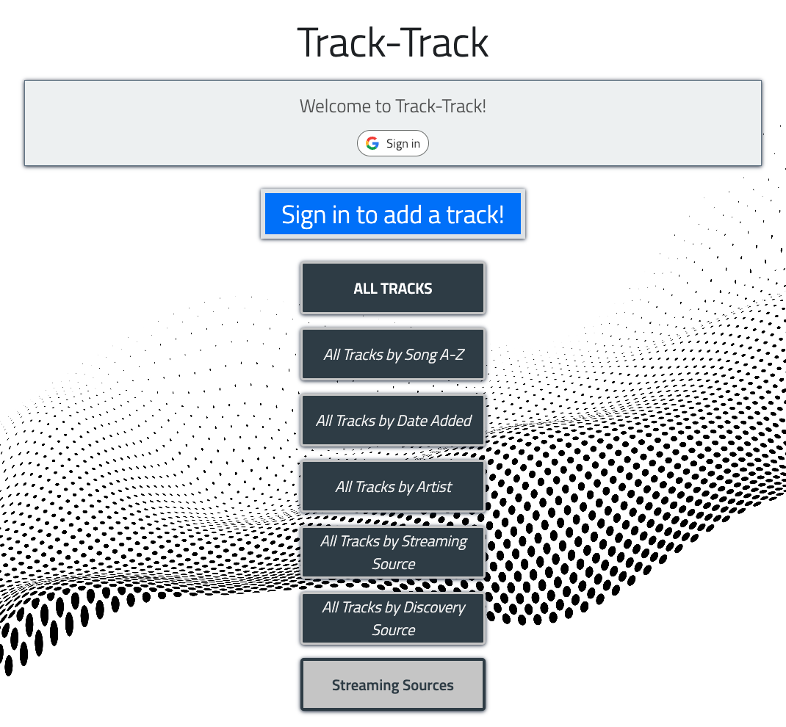
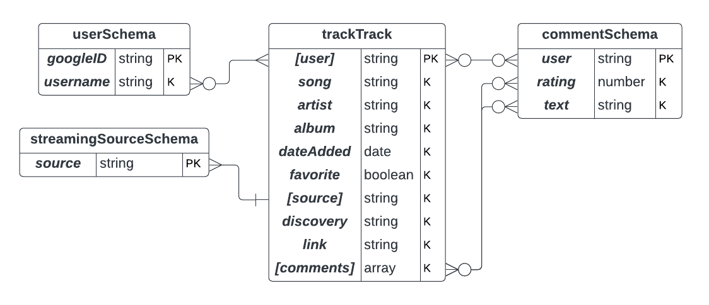
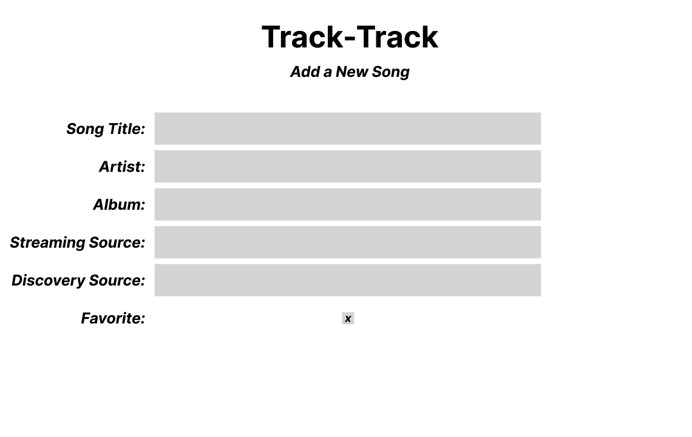

# Track-Track

## Overview

Track-Track is a solution to capture your entire music library in one place, regardless of the streaming source. The intention of Track-Track is not to play music, but rather to keep track of the music library of a user in an interactive database free of what music services they are currently subscribed to. Additionally, Track-Track aims to capture memories as users add music to their library, keeping track of where the user originally discovered a song.

## Getting Started

Launch [Track-Track here](https://track-track.fly.dev)!

### Home Page

### Add New Song

### Display All Tracks

## Features
### Current Features
    - Music library information stored in a database.

    - User login via Google OAuth, giving users the ability to have their own music libraries of which only they can add to or otherwise make modifications to as the active user, and, the ability to make comments on and add ratings to tracks.

    - Music library database is able to store and keep track of relevant information pertaining to each track, including song Title, Artist, Album, Streaming Source, and Discovery Source.

    - Track entries can be marked as 'favorites' by users.

    - Music library information can be displayed in dynamic filters/formats, including chronologically, alphabetically, by Artist, by Streaming Source, by Discovery Source, etc.

    - Ability to add/edit/delete entries in the music library database.

    - Ability for users to leave comments and ratings on all tracks in the database.

    - Ability for users to edit/modify/delete their own comments.

    - YouTube integration automatically displaying a YouTube player on the Track Detail page when 'YouTube' is selected as the Streaming Source for the track and a valid YouTube link is populated in the 'Link' field.

### Future Enhancements & Features
    - APIs for all streaming sources & links.

    - Create playlists, both for individual users and public/shared.

    - Import other music libraries (.csv files, etc.).

    - Export individual user Track-Track music library data (.csv files, etc.).

    - User profiles pages called 'Track-Space,' which can be highly customizable and showcase a user's personal music collection.

    - Social media integration.

    - Increase functionality of 'Discovery Source' to have it's own schema and view pages. Make the sources specific to each user, with the ability to add greater detail in more fields, etc.

### Technologies Used
    - HTML, CSS, JS
    - EJS [4.18.2]
    - MongoDB [5.8.1]
    - Mongoose [7.5.0]
    - Morgan [1.9.1]
    - Dotenv [16.3.1]
    - Passport [0.6.0]
    - Google OAuth [2.0.0]
    - Google+ API
    - YouTube Data API [v3]
    - Axios [1.5.0]
    - Bootstrap [5.3.1]

## User Stories

### Current (In-Progress)
    - As a user, I want the application to have an inviting, fun, music-themed design.

### Ice Box (Future Enhancements)
    - As a user, I want the ability for the application to play music on the track detail page from any added source if I populate the 'link' field with a link to the track in that source.
    - As a user, I want the ability to create playlists both specific to me and public/shared and have the two be differentiated and convertible.
    - As a user, I want the ability to import my music data from other music libraries if I upload a .csv file, etc.
    - As a user, I want the ability to export my Track-Track music library data so that it can be used in other music library applications by having the app make a .csv file, etc., available for download.
    - As a user, I want the ability to have a user profile page within the application of which I can customize the appearance and showcase my personal music collection.
    - As a user, I want the ability to have the application integrate with social media applications like Instagram, TikTok, Facebook, Reddit, etc.
    - As a user, I want the ability to add greater detail to my discovery sources and have those details stored in a manner specific to me.

### Completed (MVP)
    - As a user, I want the ability to load the application in a web browser.
    - As a user, I want the ability to store music information in a database for the information to be recalled in the future for later use.
    - As a user, I want the ability to edit or otherwise modify music information that was previously entered.
    - As a user, I want the ability to delete music information that was previously entered.
    - As a user, I want to be able to store information pertaining to individual songs, at minimum, including song Title, Artist, Album, Streaming Source, and Discovery Source.
    - As a user, I want the ability to mark certain songs as 'Favorites.'
    - As a user, I want the ability to be the only person with the ability to add, edit, or delete my personal music information.
    - As a user, I want to be able to see my music data displayed in different formats, including chronologically, alphabetically, by Artist, by Streaming Source, by Discovery Source, etc.
    - As a user, I want the ability to 'log in' to the app to only see my information.
    - As a user, I want the ability to interact with the application and database in a manner that is user friendly and familiar to the look and feel of other apps I use regularly.
    - As a user, I want the application to automatically display a YouTube video for a song on the Track Detail page, if a YouTube link is entered in the Link field.
    - As a user, I want the ability to have other users leave comments and ratings about individual tracks in my music collection.

## Entity Relationship Diagram (ERD)

## Wireframes

### Main Landing Page

### Add New Song

### Display Songs
